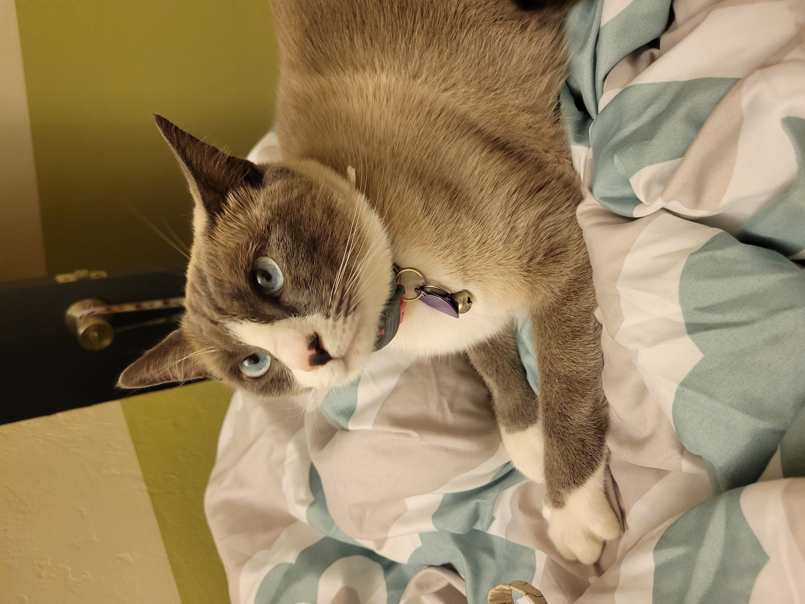

# **Hello, I am _Lynn_.**

I am currently a second year transfer student at UCSD studying CSE.

# Index
1. [About Me](https://lmidang.github.io/Github_Pages#about-me)
2. [Readme](README.md)
3. Screenshot of command line git transactions [1](screenshots/screen_1.JPG)[2](screenshots/screen_2.JPG)
4. Screenshot of staged commit [1](screenshots/screen_6.JPG)
5. [My LinkedIn](https://www.linkedin.com/in/lmdang/)

## About Me
My current interests in CS are:
* Graphics and animation
* Computer vision
* Machine learning

My hobbies are:
* Drawing
* ~~Watching anime~~
* ***Playing games***
  * Currently playing *Final Fantasy XIV*
  * Other favorite games include *Nier* and *Ace Attorney*
* Baking and trying out new food

My current goals are:
- [ ] Learn to code better
- [ ] Eat different kinds of foods
- [ ] Get a job with decent pay so I can get my own cat
- [x] Bake macarons

```
print(cats are wonderful)
```

> I like cats.

